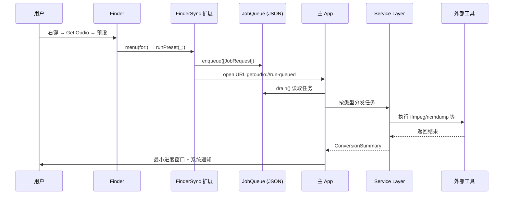

# Get Oudio 开发指导文档

## 一、项目概述

**Get Oudio** 是一款 macOS 原生音频转换工具，本质上是为以下开源项目提供 GUI 封装：

| 开源工具 | 用途 | 分发方式 |
|---------|------|---------|
| ffmpeg | 音频重编码 / 视频提取音频 | **内嵌精简版**（3.3MB，仅音频编解码） |
| ncmdump | NCM 加密音乐转换 | **内嵌**（ThirdParty/ncmdump/） |
| apple-music-downloader | Apple Music 下载 | **内嵌**（ThirdParty/apple-music-downloader/） |
| docker CLI | Docker 客户端 | **内嵌**（ThirdParty/docker/） |
| Colima + Lima | macOS Docker 运行时 | **内嵌**（ThirdParty/colima/，含 limactl） |
| MP4Box (gpac) | Apple Music MP4 封装 | **内嵌**（ThirdParty/gpac/） |
| wrapper (Docker) | Apple Music 下载的认证容器 | 运行时拉取 Docker 镜像 |

所有运行时依赖均已内嵌到 App Bundle 的 `ThirdParty/` 目录中，**无需用户安装 Homebrew 或任何系统级依赖**。应用所有 target 均已启用 App Sandbox。

---

## 二、项目结构与构建系统

### 2.1 项目文件布局

```
get-oudio/
├── project.yml                          # XcodeGen 项目定义（入口）
├── GetOudio/                            # 主 App Target
│   ├── App/                             # App 入口 & 生命周期
│   │   ├── main.swift                   # 入口分叉：headless → HeadlessRunner / normal → NormalLauncher
│   │   ├── HeadlessRunner.swift         # 无窗口后台子进程（NSApplicationDelegate）
│   │   ├── NormalLauncher.swift         # 前台启动：AppKit 手动创建 NSWindow + NSHostingController
│   │   ├── GetOudioApp.swift            # SwiftUI App 空壳（不再 @main，保留以兼容项目文件列表）
│   │   ├── AppDelegate.swift            # NSApplicationDelegate（简化，仅处理文件打开）
│   │   ├── EventHandlingView.swift      # （已弃用，保留以兼容编译）
│   │   └── Notifications.swift          # 自定义 Notification.Name 定义
│   ├── Models/
│   │   ├── AppModel.swift               # @MainActor 核心状态管理（ObservableObject）
│   │   ├── SettingsViewModel.swift      # 设置页 ViewModel
│   │   └── KeychainService.swift        # macOS Keychain 封装（存储 Apple ID）
│   ├── Views/
│   │   ├── MainView.swift               # 主窗口：NavigationSplitView + 侧边栏
│   │   ├── MainSettingsPages.swift      # 各设置页面（重编码、NCM、AM、依赖）
│   │   ├── DashboardView.swift          # 概览页
│   │   ├── SettingsView.swift           # 独立设置窗口（旧版 TabView 风格，保留）
│   │   └── AppleMusicSetupView.swift    # Apple Music 初始化窗口
│   └── Resources/
│       ├── AppIcon.icon/                # macOS 11+ 图标封装（icon.json + SVG 图层）
│       └── ThirdParty/                  # 内嵌的第三方可执行文件
│           ├── ffmpeg/ffmpeg            # 精简版 ffmpeg（仅音频，3.3MB）
│           ├── gpac/MP4Box             # MP4Box + libgpac + 模块
│           ├── docker/docker            # Docker CLI
│           ├── colima/                  # Colima + limactl + Lima guest agent
│           ├── ncmdump/bin/ncmdump
│           ├── ncmdump/bin/libtag.2.dylib
│           └── apple-music-downloader/apple-music-downloader
├── GetOudioCore/                        # 共享框架 Target
│   └── Sources/
│       ├── Models/                      # 数据模型
│       │   ├── ConversionPreset.swift   # 重编码预设枚举 & ffmpeg 参数生成
│       │   ├── FileCategory.swift       # 文件分类（音频/视频/NCM/AM）
│       │   ├── JobRequest.swift         # 任务请求模型 & 编解码
│       │   └── Dependency.swift         # 依赖/内嵌组件/Docker 镜像模型
│       ├── Services/                    # 业务逻辑服务
│       │   ├── AudioConversionService.swift    # ffmpeg 重编码
│       │   ├── MediaExtractionService.swift    # 视频提取音频
│       │   ├── NCMConversionService.swift      # ncmdump 转换
│       │   ├── AppleMusicDownloadService.swift # AM 下载调度
│       │   ├── AppleMusicWrapperRuntime.swift  # Docker wrapper 容器管理
│       │   ├── ColimaDockerRuntime.swift       # Colima + Docker 运行时
│       │   ├── DependencyManager.swift         # 依赖检测/安装
│       │   ├── JobQueue.swift                  # 跨进程任务队列（JSON 文件）
│       │   ├── ProcessRunner.swift             # Process 封装（同步/异步执行命令）
│       │   ├── NotificationService.swift       # 系统通知
│       │   ├── DiagnosticLog.swift             # App Group 文本诊断日志
│       │   └── SettingsStore.swift             # UserDefaults 持久化
│       └── Support/
│           ├── AppConstants.swift        # Bundle ID、App Group、URL Scheme 常量
│           └── SharedContainer.swift     # App Group 共享容器路径
├── GetOudioFinderExtension/             # Finder 右键扩展 Target
│   └── Sources/FinderSync.swift         # FIFinderSync 实现
├── GetOudioShareExtension/             # 系统分享扩展 Target
│   └── Sources/ShareExtension.swift     # NSExtensionRequestHandling 实现
├── script/
│   ├── build_and_run.sh                # 构建运行脚本
│   ├── bundle_deps.sh                  # 从 Homebrew 提取运行时依赖到 ThirdParty/
│   └── build_minimal_ffmpeg.sh         # 从源码编译精简版 ffmpeg
```

### 2.2 构建系统：XcodeGen

项目使用 **XcodeGen**（`project.yml`）而非手动管理 `.xcodeproj`。关键配置：

```yaml
# project.yml 核心内容
targets:
  GetOudioCore:     # 共享框架 (framework)
  GetOudio:         # 主 App (application)
    dependencies:
      - GetOudioCore
      - GetOudioFinderExtension  # embed: true
      - GetOudioShareExtension   # embed: true
  GetOudioFinderExtension:  # Finder 扩展 (app-extension)
  GetOudioShareExtension:   # 分享扩展 (app-extension)
```

> **图标配置**：App Icon 使用 macOS 14+ 的 Icon Composer `.icon` 封装格式（`icon.json` + SVG 图层），位于 `Resources/AppIcon.icon/`。
>
> **关键配置要点**（参考 [Pearcleaner](https://github.com/alienator88/Pearcleaner) 项目方案）：
> 1. `lastKnownFileType` 必须设为 `folder.iconcomposer.icon`，否则 `actools` 无法识别该文件为独立图标，会报 `attempt to insert nil object` 错误
> 2. 构建配置需添加 `ASSETCATALOG_COMPILER_STANDALONE_ICON_BEHAVIOR = default`，告知 `actools` 按独立图标方式处理
> 3. `ASSETCATALOG_COMPILER_SKIP_APP_STORE_DEPLOYMENT = YES`（非 App Store 分发优化）
> 4. `Info.plist` 仅保留 `CFBundleIconName = AppIcon`，删除已废弃的 `CFBundleIconFile`
> 5. 因 XcodeGen 暂不支持直接设置 `folder.iconcomposer.icon` 类型，`project.yml` 的 `postGenCommand` 会自动修补生成的 `project.pbxproj`

**构建方式**：运行 `script/build_and_run.sh` 或手动执行 `xcodegen generate && xcodebuild`。

---

## 三、架构设计

### 3.1 整体架构图

```mermaid
graph TB
    subgraph "主 App 入口 (main.swift)"
        MAIN[main.swift<br/>入口分叉]
        HR[HeadlessRunner<br/>无窗口后台子进程]
        NL[NormalLauncher<br/>AppKit 手动窗口管理]
    end

    subgraph "主 App (GetOudio)"
        AD[AppDelegate<br/>文件打开 / 通知]
        AM[AppModel<br/>@MainActor 状态中心]
        MV[MainView<br/>侧边栏导航]
        SV[SettingsViewModel<br/>设置管理]
    end

    subgraph "共享框架 (GetOudioCore)"
        SS[SettingsStore<br/>UserDefaults]
        JQ[JobQueue<br/>JSON 文件队列]
        DL[DiagnosticLog<br/>文本诊断日志]
        PR[ProcessRunner<br/>进程执行]
        ACS[AudioConversionService]
        MES[MediaExtractionService]
        NCS[NCMConversionService]
        AMS[AppleMusicDownloadService]
        DM[DependencyManager]
        CDR[ColimaDockerRuntime]
        AMW[AppleMusicWrapperRuntime]
        NS[NotificationService]
    end

    subgraph "扩展"
        FS[FinderSync<br/>右键菜单]
        SE[ShareExtension<br/>系统分享]
    end

    subgraph "共享存储"
        SC[App Group Container<br/>group.com.shengjiacheng.GetOudio]
        UD[Shared UserDefaults]
        QF[queued-jobs.json]
        LF[conversion-log.txt]
    end

    subgraph "外部工具（全部内嵌）"
        FF[ffmpeg<br/>精简版 3.3MB]
        NC[ncmdump]
        AMD[apple-music-downloader]
        DW[Docker CLI]
        CL[Colima + Lima]
        MP[MP4Box / gpac]
    end

    MAIN -->|headless| HR
    MAIN -->|normal| NL
    NL -->|NSHostingController| MV
    NL -->|NSHostingController| CV
    NL --> AD
    NL --> AM
    HR --> JQ
    HR --> NS
    AM --> ACS & MES & NCS & AMS
    ACS & MES --> PR --> FF
    NCS --> PR --> NC
    AMS --> PR --> AMD
    AMS --> AMW --> CDR --> DW
    FS --> JQ --> QF
    FS --> DL --> LF
    SE --> JQ
    FS --> SS --> UD
    AM --> NS
    AM --> DL
    AM --> JQ
    SV --> SS
```

### 3.2 核心设计模式

| 模式 | 实现位置 | 说明 |
|------|---------|------|
| **MVVM** | `AppModel` / `SettingsViewModel` + Views | ObservableObject 驱动 SwiftUI 更新 |
| **Service Layer** | `GetOudioCore/Sources/Services/` | 每个功能独立一个 Service 类 |
| **Job Queue** | `JobQueue` (JSON 文件) | 跨进程任务队列，Finder 扩展写入，主 App 消费 |
| **Shared Container** | `SharedContainer` + App Group | 主 App 与扩展间共享数据 |
| **Dependency Injection** | 各 Service 的 `init()` 默认参数 | 通过默认参数实现简易 DI |
| **Strategy Pattern** | `ConversionPreset.ffmpegArguments()` | 不同编码预设返回不同的 ffmpeg 参数 |

---

## 四、各功能实现详解

### 4.1 音频重编码 (Transcoding)

**调用链路**：
```
用户操作 → AppModel.runTranscode(preset:) → AudioConversionService.convert() → ProcessRunner.run() → ffmpeg
```

**核心代码**：`GetOudioCore/Sources/Services/AudioConversionService.swift`

```swift
// 1. 检测 ffmpeg 是否存在
let ffmpeg = await dependencyManager.check(.ffmpeg)
guard let ffmpegPath = ffmpeg.resolvedPath else { /* 报错 */ }

// 2. 遍历任务，按预设生成 ffmpeg 参数
for job in jobs {
    guard case .transcode(let preset) = job.operation else { continue }
    let outputURL = preset.outputURL(for: job.fileURL)
    let arguments = preset.ffmpegArguments(inputURL: job.fileURL, outputURL: outputURL)
    let result = try await runner.run(executablePath: ffmpegPath, arguments: arguments)
}
```

**预设系统**：`ConversionPreset` 枚举定义了 15 种编码方案，分为 5 组：

| 分组 | 预设 | ffmpeg 参数 |
|------|------|------------|
| AAC | 128/256/320 Kbps | `-acodec aac -b:a {bitrate}` → `.m4a` |
| MP3 | 128/256/320 Kbps | `-acodec libmp3lame -b:a {bitrate}` → `.mp3` |
| ALAC | 24bit48k/16bit48k/Original | `-acodec alac [-ar 48000 -sample_fmt s32p/s16p]` → `.m4a` |
| FLAC | 24bit48k/16bit48k/Original | `-acodec flac [-ar 48000 -sample_fmt s32/s16]` → `.flac` |
| PCM | 24bit48k/16bit48k/Original | `-acodec pcm_s24le/pcm_s16le [-ar 48000]` → `.wav` |

输出文件名由 `ConversionPreset.outputURL(for:)` 统一生成，格式为 `原文件名 [预设名].扩展名`，例如 `song [AAC 128Kbps].m4a`。这样既能让 Finder 右键转换后的文件名直接表达编码结果，也能避免输入和输出同扩展名时覆盖或碰撞。

所有命令统一显式选择第一条音频流并复制全局元数据：`-map 0:a:0 -map_metadata 0:g -map_chapters 0 -y -vn`。AAC、ALAC 等 `.m4a` 输出会追加 `-movflags use_metadata_tags`，MP3 输出会追加 `-write_id3v2 1 -id3v2_version 3`，以提高常见播放器中的文本元数据兼容性。当前实现会去除视频流，因此嵌入封面的保留不作为保证项；如果后续需要完整保留封面，需要单独处理 attached picture 流或外部封面文件。

### 4.2 从视频提取音频 (Media Extraction)

**调用链路**：
```
用户操作 → AppModel.runExtractAudio() → MediaExtractionService.extractAudio() → ProcessRunner.run() → ffmpeg
```

**核心逻辑**：

1. **探测音频编码**：先用 `ffmpeg -i <video>` 获取流信息，正则匹配 `Audio: <codec>` 确定编码格式
2. **自动选择容器**：根据编码选封装——AAC → `.m4a`、Vorbis/Opus → `.ogg`、MP3 → `.mp3`、FLAC → `.flac`、AC-3 → `.ac3`，其余使用编码名作为扩展名
3. **无损复制**：`ffmpeg -i <input> -c:a copy -map_metadata 0 -vn -y <output>`（不重新编码）

### 4.3 NCM 加密音乐转换

**调用链路**：
```
用户操作 → AppModel.runNCMConversion() → NCMConversionService.convert() → ProcessRunner.run() → ncmdump
```

**实现要点**：

- **内嵌可执行文件**：`Resources/ThirdParty/ncmdump/bin/ncmdump` 随 App 打包，运行所需的 `libtag.2.dylib` 也放在同一目录并通过 rpath 解析
- **输出位置**：遵循用户设置——源文件目录（默认）或自定义目录
- **逐项处理**：服务层按文件逐个启动安全作用域访问、创建输出目录并调用 ncmdump，便于为每个文件维护独立进度和错误信息：
  ```swift
  let arguments = ["-o", outputDirectory.path, access.fileURL.path]
  let result = try await runner.run(executablePath: executableURL.path, arguments: arguments)
  ```

### 4.4 Apple Music 下载

**调用链路**：
```
用户操作 → AppModel.runAppleMusicDownload() → AppleMusicDownloadService.download()
    ├── 下载前：AppleMusicWrapperRuntime.ensureServerRunning()
    │       ├── ColimaDockerRuntime.ensureRunning() → colima start
    │       └── docker run -d --name get-oudio-wrapper ... ghcr.io/itouakirai/wrapper:x86
    └── 下载：ProcessRunner.run() → apple-music-downloader <url>
```

**架构分层**：

| 层 | 类 | 职责 |
|---|-----|------|
| 调度层 | `AppleMusicDownloadService` | 编排下载流程、配置渲染 |
| 容器运行时 | `AppleMusicWrapperRuntime` | 管理 wrapper Docker 容器生命周期 |
| Docker 运行时 | `ColimaDockerRuntime` | 管理 Colima + Docker 环境（内嵌二进制，自动注入 PATH） |
| 镜像管理 | `DockerImageManager` | 检测/拉取 Docker 镜像 |
| 配置管理 | `SettingsStore` | 存储下载格式、输出目录 |

**初始化流程**（首次使用）：
1. 用户在设置页输入 Apple ID / 密码 → 存入 Keychain
2. 点击「开始初始化」→ `AppleMusicWrapperRuntime.initialize()`
3. 拉取 `ghcr.io/itouakirai/wrapper:x86` 镜像（linux/amd64 平台）
4. 启动 Colima → 运行容器：`docker run --platform linux/amd64 -e "args=-L user:pass -F" --rm wrapper`
5. 容器内执行 Apple Music 登录，若触发 2FA，用户在界面输入验证码 → 写入 `2fa.txt` 到容器挂载目录

**下载流程**：
1. `ensureServerRunning()` 确保 `get-oudio-wrapper` 容器在后台运行（映射端口 10020/20020/30020）
2. 渲染 `config.yaml` 模板（输出路径等）
3. 调用 `apple-music-downloader` 可执行文件，传入 AM 链接
4. 下载完成后文件存入用户指定的输出目录

**格式选择**：
- `.askEveryTime`：每次询问（fallback 到 ALAC）
- `.alac`：无损
- `.aac`：有损（`--aac` 参数）
- `.atmos`：杜比全景声（`--atmos` 参数）

### 4.5 Finder 右键扩展 (Finder Sync Extension)

**实现方式**：

`FIFinderSync` 是 macOS 提供的 Finder 扩展 API，通过继承 `FIFinderSync` 实现。

**核心代码**：`GetOudioFinderExtension/Sources/FinderSync.swift`

**关键点**：

1. **目录监听**：
   ```swift
   FIFinderSyncController.default().directoryURLs = Set(settingsStore.finderDirectoryURLs)
   ```
   仅用户在设置中添加的目录（默认为桌面/下载/音乐/影片/文档）会显示右键菜单。

2. **菜单动态生成**：
   - 检测选中文件的类型（音频/视频/NCM）
   - 纯音频文件 → 一级菜单显示「Get Oudio」，二级子菜单列出所有启用的重编码预设
   - 纯视频文件 → 一级菜单显示「Get Oudio」，直接执行提取音频
   - 纯 NCM 文件 → 一级菜单显示「Get Oudio」，直接执行 NCM 转换
   - 混合选择 → 一级菜单显示「Get Oudio」，子菜单中按可处理类型显示预设、提取视频音频和转换 NCM
   - 无有效文件 → 显示灰色「没有可处理的音视频或 NCM 文件」

   音频预设子菜单采用固定 selector（例如 `runAAC128`、`runMP3128`）而不是依赖 `NSMenuItem.representedObject`。原因是 Finder Sync 在部分右键子菜单路径中会丢失 `representedObject` 或 `identifier`，固定 selector 配合扩展内的 `lastAudioSelection` 能保证预设和选中文件稳定传递。

3. **任务入队**（不直接执行）：
   ```swift
   let jobs = selectedURLs.map { JobRequest(fileURL: $0, category: ..., operation: ..., source: .finderSync) }
   let queue = try JobQueue()
   try queue.enqueue(jobs)
   ```
   扩展本身不执行耗时操作，而是将任务写入共享 JSON 队列文件。

4. **唤醒主 App**：
   ```swift
   openContainingApp() // 通过 URL Scheme getoudio://run-queued 打开主 App
   ```

   URL 唤醒不是“打开转换窗口”的入口，而是后台队列执行入口。主 App 收到 `getoudio://run-queued` 后会调用 `AppModel.receiveAndRunQueuedJobs()`，drain 队列后立即按任务类型执行，并通过进度窗口和系统通知反馈结果。

### 4.6 系统分享扩展 (Share Extension)

**实现方式**：

`ShareExtension` 实现 `NSExtensionRequestHandling` 协议。

**核心代码**：`GetOudioShareExtension/Sources/ShareExtension.swift`

**流程**：

1. 用户在浏览器/音乐 App 中点击「分享」→ 选择「Get Oudio」
2. Extension 从 `NSExtensionContext` 中提取 URL（支持直接 URL、纯文本、Data 三种格式）
3. 仅处理被分类为 `.appleMusic` 的链接（`http`/`https`/`music` scheme）
4. 将任务写入 JobQueue，打开主 App：`getoudio://run-queued`
5. 调用 `context.completeRequest()` 关闭分享面板

分享扩展和 Finder 扩展共用同一个队列唤醒机制。普通转换任务会后台执行；Apple Music 如果设置为“每次询问”或初始化状态不足，仍允许进入主 App 的交互流程完成选择或初始化。

### 4.7 跨进程通信与任务队列

**共享机制**：通过 **App Group**（`group.com.shengjiacheng.GetOudio`）实现主 App 与扩展之间的数据共享。

| 共享内容 | 实现方式 | 位置 |
|---------|---------|------|
| 任务队列 | JSON 文件 `queued-jobs.json` | `SharedContainer.directory()` |
| 转换诊断日志 | 文本文件 `conversion-log.txt` | `SharedContainer.directory()` |
| 设置数据 | `UserDefaults(suiteName:)` | `SharedContainer.defaults()` |
| Apple Music 运行时 | 子目录 `AppleMusicWrapper/` | `SharedContainer.directory()` |
| AM 下载器工作目录 | 子目录 `AppleMusicDownloader/` | `SharedContainer.directory()` |

**JobQueue 实现**（`GetOudioCore/Sources/Services/JobQueue.swift`）：

- 本质是 `[JobRequest]` 数组的 JSON 序列化文件
- `enqueue()`：读取 → 追加 → 写回
- `drain()`：读取 → 清空 → 返回读取内容
- `JobRequest` 实现了 `Codable`，支持 `JobOperation` 枚举的序列化

**事件流转**：



`AppModel.receiveAndRunQueuedJobs()` 内部通过 `isHandlingQueuedJobs` 与 `isRunning` 去重，避免主窗口、转换窗口或 URL 事件重复触发时同时 drain 队列。每次后台执行结束后，结构化摘要会写入 `conversion-log.txt`，Finder 扩展本身也会把菜单生成、任务入队和 URL 唤醒等事件写入同一个诊断日志。

### 4.8 进程执行 (ProcessRunner)

**核心类**：`GetOudioCore/Sources/Services/ProcessRunner.swift`

统一封装 Foundation `Process`：

```swift
// 同步执行（在 Task.detached 中运行，避免阻塞主线程）
func run(executablePath: String, arguments: [String], currentDirectoryURL: URL? = nil, environment: [String: String]? = nil) async throws -> ProcessResult

// Shell 命令执行
func runShell(_ command: String) async throws -> ProcessResult  // 等价于 /bin/zsh -lc "<command>"
```

- 执行前校验文件存在且可执行
- 支持通过 `environment` 参数注入环境变量（ColimaDockerRuntime 利用此机制将内嵌目录加入 PATH）
- 通过 `Pipe` 捕获 stdout 和 stderr
- 返回 `ProcessResult`（含 exitCode、stdout、stderr）

### 4.9 依赖管理系统

**三层依赖体系**：

| 层级 | 类 | 检测方式 | 获取方式 |
|------|-----|---------|---------|
| 运行时工具 | `DependencyManager` | 优先检查内嵌路径 → 回退 `which` | 内嵌或 `brew install` |
| 内嵌组件 | `BundledComponentManager` | 检查 `Bundle.main.resourceURL` 下文件 | 放入 `ThirdParty/` |
| Docker 镜像 | `DockerImageManager` | `docker image inspect` | `docker pull` |

**运行时工具列表**（按优先级排序）：
1. **Homebrew** — 可选，其他工具已内嵌，无需强制安装
2. **ffmpeg** — 音频转换核心（**内嵌精简版**，3.3MB，仅音频编解码）
3. **Docker CLI** — Apple Music 功能需要（**内嵌**）
4. **Colima** — macOS 上的 Docker 运行时（**内嵌**，含 Lima）
5. **GPAC / MP4Box** — Apple Music 下载的 MP4 封装（**内嵌**）
6. **Go** — 非运行时依赖（apple-music-downloader 已预编译为静态二进制）

**检测流程**：
```swift
// DependencyManager.check()——优先使用内嵌版本
if let bundledPath = dependency.bundledRelativePath,
   let resourceRoot = Bundle.main.resourceURL {
    let bundledURL = resourceRoot.appendingPathComponent(bundledPath)
    if FileManager.default.isExecutableFile(atPath: bundledURL.path) {
        return DependencyStatus(..., resolvedPath: bundledURL.path, detail: "内嵌")
    }
}
// 回退到系统 PATH
let result = try await runner.run(executablePath: "/usr/bin/which", arguments: [dependency.executableName])
```

`RuntimeDependency.bundledRelativePath` 映射：

| 依赖 | 内嵌路径（相对于 ThirdParty/） |
|------|------|
| ffmpeg | `ThirdParty/ffmpeg/ffmpeg` |
| docker | `ThirdParty/docker/docker` |
| gpac | `ThirdParty/gpac/MP4Box` |
| colima | `ThirdParty/colima/colima` |

### 4.10 设置持久化

**SettingsStore**（`GetOudioCore/Sources/Services/SettingsStore.swift`）：

使用 App Group 共享的 `UserDefaults`，使设置对主 App 和 Finder 扩展都可读。

| 存储键 | 类型 | 默认值 | 说明 |
|--------|------|--------|------|
| `enabledPresetIDs` | `[String]` | 全部启用 | Finder 菜单显示的预设 |
| `finderDirectoryPaths` | `[String]` | Desktop/Downloads/Music/Movies/Documents | 监听目录 |
| `ncmOutputMode` | `String` | `"sourceDirectory"` | NCM 输出模式 |
| `ncmCustomOutputPath` | `String` | nil | NCM 自定义输出目录 |
| `appleMusicOutputPath` | `String` | `~/Music/Get Oudio` | AM 下载目录 |
| `appleMusicDownloadMode` | `String` | `"askEveryTime"` | AM 下载格式 |

**KeychainService**：使用 macOS Keychain 安全存储 Apple ID 和密码，不存储在 UserDefaults 中。

`enabledPresetIDs` 不允许持久化为空。`SettingsStore` 读取到空数组时会回退到默认启用预设，设置页也会阻止用户关闭最后一个预设，避免 Finder 音频子菜单没有可执行项。

### 4.11 文件类型识别

**FileCategory.classify()**（`GetOudioCore/Sources/Models/FileCategory.swift`）：

```
URL → 检测 scheme 是否为 http/https/music → .appleMusic
    → 检测扩展名是否为 .ncm → .ncm
    → 检测扩展名是否在内置音频扩展集合 → .audio
    → 检测扩展名是否在内置视频扩展集合 → .video
    → 通过 UTType 检测是否 conforms to .audio → .audio
    → 通过 UTType 检测是否 conforms to .movie/.audiovisualContent → .video
    → 否则 → .unsupported
```

显式扩展名集合优先于 UTType，是为了覆盖 Finder 扩展环境下部分格式 UTType 解析不稳定的问题。音频集合包含 `aac`、`aif`、`aiff`、`alac`、`ape`、`caf`、`flac`、`m4a`、`m4b`、`mp3`、`ogg`、`opus`、`wav`、`wma`；视频集合包含 `avi`、`flv`、`m4v`、`mkv`、`mov`、`mp4`、`mpeg`、`mpg`、`webm`、`wmv`。

---

## 五、窗口管理（需求 4 重构）

### 5.1 核心问题

Finder Sync 扩展通过 URL Scheme `getoudio://run-queued` 唤醒主 App 消费任务队列。但 macOS 在启动 App 时默认以 `.regular` 前台模式初始化，会产生短暂的 Dock 图标动画和窗口框架闪现（< 200ms）。这对后台任务体验造成干扰。

### 5.2 解决方案：双路径入口 + 浮动面板窗口

**关键设计决策**：

| 决策 | 方案 | 原因 |
|------|------|------|
| 消除窗口闪现 | `Info.plist` 中 `LSUIElement = true` | 系统从一开始就不创建任何 UI |
| 前台模式下显示窗口 | `NormalLauncher` 用 AppKit 手动 `NSWindow` + `NSHostingController` | SwiftUI 的 `WindowGroup` 在 `LSUIElement` 下无法创建可见窗口 |
| 窗口不被台前调度管理 | `window.level = .floating` + `collectionBehavior = [.canJoinAllSpaces, .fullScreenAuxiliary, .ignoresCycle, .stationary]` | 浮动面板不受 Stage Manager / Mission Control / 第三方窗口管理器控制 |
| 后台执行完全无窗口 | `HeadlessRunner`：`NSApplicationDelegate` + `.accessory`，纯后台处理 | 不创建任何 `NSWindow`，仅通过 `UserNotification` 反馈结果 |

### 5.3 入口分叉 (main.swift)

```swift
// main.swift —— 整个 App 的唯一入口
let isHeadless = /* 检查共享 UserDefaults 中的 LaunchSource 标记 */

if isHeadless {
    HeadlessRunner.main()    // → 无窗口后台路径
} else {
    NormalLauncher.main()    // → AppKit 手动窗口路径
}
```

`isHeadless` 的检测依赖 Finder/Share 扩展在调用 `NSWorkspace.open(url)` 前写入共享 `UserDefaults` 的 `ExtensionLaunchSource` 和 `ExtensionLaunchTimestamp` 键。检测有效期为 10 秒，防止残留标记误判。

### 5.4 HeadlessRunner（无窗口后台子进程）

**类**：`GetOudio/App/HeadlessRunner.swift`

**角色**：`NSApplicationDelegate` + `UNUserNotificationCenterDelegate`

**流程**：
```
main.swift → HeadlessRunner.main()
  ├── NSApplication.shared
  ├── setActivationPolicy(.accessory)    ← 无 Dock 图标、无菜单栏
  ├── app.delegate = self
  ├── app.run()
  └── applicationDidFinishLaunching:
        ├── UNUserNotificationCenter delegate 设置
        ├── JobQueue.drain() → 获取任务列表
        ├── 调用 Service Layer 处理（AudioConversionService / NCMConversionService 等）
        ├── 发送 UserNotification（横幅 + 音效）
        └── 1.5s 后 NSApp.terminate(nil)
```

**关键特征**：
- **从不创建任何 `NSWindow`**——连 `NSApplication.shared.windows` 都保持为空
- `setActivationPolicy(.accessory)` 在 `app.run()` 之前调用，确保窗口服务器注册时已是后台状态
- 所有 Service 均来自 `GetOudioCore`，与前台路径共享同一套业务逻辑
- `applicationWillFinishLaunching` 和 `applicationDidFinishLaunching` 中会遍历 `NSApp.windows` 并关闭任何残留窗口（belt-and-suspenders）

### 5.5 NormalLauncher（AppKit 手动窗口管理）

**类**：`GetOudio/App/NormalLauncher.swift`

**角色**：`NSApplicationDelegate` + `UNUserNotificationCenterDelegate`

**为何不用 SwiftUI `WindowGroup`**：`LSUIElement = true` 阻止了 SwiftUI 的 `WindowGroup` 创建可见窗口。因此改为用 AppKit 手动创建 `NSWindow`，通过 `NSHostingController` 承载 SwiftUI View。

**流程**：
```
main.swift → NormalLauncher.main()
  ├── MainActor.assumeIsolated {                    ← 入口在 main thread
  │     ├── NSApplication.shared
  │     ├── setActivationPolicy(.regular)            ← 恢复前台 GUI 模式
  │     ├── app.delegate = self
  │     └── app.run()
  │   }
  └── applicationDidFinishLaunching:
        ├── 构建 NSHostingController(rootView: MainView().environmentObject(appModel))
        ├── 创建 NSWindow(contentViewController: hostingController)
        ├── window.level = .floating                 ← 浮动面板
        ├── window.collectionBehavior = [            ← 不被窗口管理器控制
        │       .canJoinAllSpaces,                   ← 所有空间可见
        │       .fullScreenAuxiliary,                ← 全屏时保持显示
        │       .ignoresCycle,                       ← Cmd+Tab 不切换
        │       .stationary                          ← Mission Control 不动它
        │   ]
        ├── window.makeKeyAndOrderFront(nil)
        └── NSApp.activate(ignoringOtherApps: true)
```

**浮动面板窗口效果**：

| 行为 | 效果 |
|------|------|
| 台前调度 (Stage Manager) | **不识别**此窗口 |
| Mission Control | 窗口**保持原位不移动** |
| Cmd+Tab 切换 | **不参与**循环 |
| 第三方窗口管理器 (Rectangle/Magnet 等) | **无法控制**（`.floating` level 被排除） |
| 窗口层级 | **始终浮在**普通应用窗口之上 |

**URL Scheme 处理**（App 已运行时收到 Finder 触发）：
```swift
// NormalLauncher 在 applicationWillFinishLaunching 中注册 AppleEvent 监听
NSAppleEventManager.shared().setEventHandler(
    self,
    andSelector: #selector(handleGetURLEvent(_:withReplyEvent:)),
    forEventClass: AEEventClass(kInternetEventClass),
    andEventID: AEEventID(kAEGetURL)
)

// 收到 getoudio://run-queued 时：
//   → appModel.processQueuedJobsInBackground()
//   → 不打开任何新窗口
//   → 后台处理完成 → 系统通知
```

### 5.6 AppModel 状态管理

`AppModel` 是 `@MainActor` 的 `ObservableObject`，管理：

- `openItems`：当前待处理文件列表
- `queuedJobs`：从队列文件读取的任务
- `isRunning` / `isHandlingQueuedJobs`：执行状态与去重
- `statusMessage` / `lastSummary`：状态消息和结果摘要

`processQueuedJobsInBackground()` 是统一的后台处理入口：
- 清除扩展启动标记（`ExtensionLaunchSource` / `ExtensionLaunchTimestamp`）
- 调用 `JobQueue.drain()` 获取所有待处理任务
- 遍历执行，完成后发送 `UserNotification`
- 返回 `Bool` 指示是否需要打开转换窗口（Apple Music 格式选择）

### 5.7 与旧方案对比

| 方面 | 旧方案（v1） | 旧方案（v2） | 最终方案 |
|------|-------------|-------------|---------|
| 窗口创建 | SwiftUI `WindowGroup` | SwiftUI `WindowGroup` + 条件内容 | **AppKit `NSWindow` + `NSHostingController`** |
| 后台路径 | `AppModel.showsProgressInMainWindow` | `EventHandlingView` 窗口路由 | **`HeadlessRunner` 独立子进程** |
| 窗口闪现 | 出现 | 出现（多窗口 Bug） | **无闪现**（`LSUIElement = true`） |
| 窗口管理 | 正常窗口 | 会尝试最小化/关闭 → 导致多窗口 | **浮动面板（不受管理系统影响）** |
| Queue 界面 | `ProgressWindowView` | `ProgressWindowView` + Divider | **已移除**（后台纯通知） |

---

## 六、系统通知

**NotificationService**（`GetOudioCore/Sources/Services/NotificationService.swift`）：

- App 启动时通过 `AppDelegate` 请求通知权限
- 任务完成后发送系统通知，内容根据成功/失败数量动态生成
- `UNUserNotificationCenter` delegate 在 App 前台时也返回 banner/list/sound 展示选项，避免后台队列执行时完全静默

音频重编码、视频提取、NCM 转换会分别生成对应语义的成功或失败通知。失败通知正文只保留短摘要，完整 stdout/stderr 与任务摘要写入 App Group 下的 `conversion-log.txt`，便于后续复制和定位。

---

## 七、安全与权限

### 7.1 Entitlements

**所有 target 均已启用 App Sandbox**，内嵌的第三方工具在沙盒内运行。

**主 App** (`GetOudio.entitlements`)：
- App Sandbox: **开启**
- User Selected File: 读写权限
- Downloads / Movies / Music / Pictures: 读写权限
- Network Client / Server: 允许（Docker 通信需要）
- App Groups: `group.com.shengjiacheng.GetOudio`

**Finder 扩展** (`GetOudioFinderExtension.entitlements`)：
- App Sandbox: **开启**（macOS Sequoia 强制要求）
- App Groups: `group.com.shengjiacheng.GetOudio`

**分享扩展** (`GetOudioShareExtension.entitlements`)：
- App Sandbox: **开启**（macOS Sequoia 强制要求）
- App Groups: 同上

### 7.2 Info.plist 关键配置

- **`LSUIElement = true`**：应用以 Agent 模式启动，无 Dock 图标、无菜单栏、无窗口。前台路径通过 `NormalLauncher` 手工创建 `NSWindow`。这是消除 Finder Sync 触发时窗口闪现的关键配置。
- `CFBundleIconName = AppIcon`：指定应用图标名称，与 `Resources/AppIcon.icon` 封装对应。**注意**：已删除废弃的 `CFBundleIconFile`（自 macOS 10.5 起不再使用）
- **AppIcon.icon 封装格式**：使用 macOS 14+（Sonoma）引入的 Icon Composer `.icon` 格式，通过 `icon.json` 描述图层、渐变、玻璃效果等。`supported-platforms` 声明了 `macos` 和 `squares` 两个平台
  - **构建要点**：Xcode 通过 `ASSETCATALOG_COMPILER_APPICON_NAME = AppIcon` 和 `ASSETCATALOG_COMPILER_STANDALONE_ICON_BEHAVIOR = default` 将 `.icon` 作为独立图标（standalone icon）编译进 App Bundle
  - **文件类型**：`project.pbxproj` 中 `lastKnownFileType` 必须为 `folder.iconcomposer.icon`（参考 [Pearcleaner](https://github.com/alienator88/Pearcleaner) 的 `Glass.icon` 方案），`project.yml` 的 `postGenCommand` 自动处理此项
- `CFBundleDocumentTypes`：声明支持 `public.audio`、`public.movie`、`public.audiovisual-content`、`com.shengjiacheng.getoudio.ncm` 类型
- `UTExportedTypeDeclarations`：注册 `.ncm` 文件类型
- `CFBundleURLTypes`：注册 `getoudio` URL scheme，使 Finder 扩展和分享扩展可以通过 `getoudio://run-queued` 唤醒主 App 消费队列

---

## 八、开发与调试

### 8.1 构建命令

```bash
# 生成 Xcode 项目
cd get-oudio && xcodegen generate

# 提取运行时依赖到 ThirdParty/（需先通过 brew 安装对应工具）
bash script/bundle_deps.sh

# 从源码编译精简版 ffmpeg（仅需执行一次或 ffmpeg 升级后）
bash script/build_minimal_ffmpeg.sh

# 构建运行
bash script/build_and_run.sh

# 构建后安装到 /Applications，并校验安装包 Info.plist 中的 getoudio URL scheme
bash script/build_and_run.sh --install

# 清理旧的 Get Oudio Finder/Share 扩展注册，解决系统里残留多个同名扩展的问题
bash script/build_and_run.sh --clean-plugins

# 或手动
xcodebuild -project GetOudio.xcodeproj -scheme GetOudio -configuration Release build
```

### 8.1.1 依赖嵌入脚本

- **`bundle_deps.sh`**：从 Homebrew 安装路径提取 ffmpeg、MP4Box、docker、Colima/Lima 的二进制及其依赖库，复制到 `ThirdParty/` 目录，并自动处理 dylib 的 `@loader_path` 引用
- **`build_minimal_ffmpeg.sh`**：下载 ffmpeg 源码，以最小配置编译（仅启用音频相关编解码器、解复用器、复用器），生成约 3MB 的静态链接二进制，替代 Homebrew 的 36MB 完整版本

### 8.2 调试 Finder 扩展

Finder 扩展需要特殊调试方式：
1. 在 Xcode 中选择 `GetOudioFinderExtension` scheme
2. 选择「Wait for the executable to be launched」
3. 运行后手动在 Finder 中触发右键菜单
4. 或者：`killall Finder` 重启 Finder 后触发

### 8.3 调试分享扩展

1. 选择 `GetOudioShareExtension` scheme
2. 设置 `NSExtensionActivationRule` 的宿主 App
3. 在宿主 App（如 Safari）中触发分享

### 8.4 日志查看

```bash
# 查看 Finder 扩展日志
log stream --predicate 'process == "GetOudioFinderExtension"'

# 查看分享扩展日志
log stream --predicate 'process == "GetOudioShareExtension"'

# 查看主 App 日志
log stream --predicate 'process == "Get Oudio"'

# 查看转换链路诊断日志（Finder 扩展、队列执行摘要、stdout/stderr 摘要）
cat "$HOME/Library/Group Containers/group.com.shengjiacheng.GetOudio/conversion-log.txt"
```

---

## 九、关键设计决策

1. **所有依赖内嵌、全量启用 Sandbox**：ffmpeg（精简版）、MP4Box、Docker CLI、Colima+Lima 均嵌入 App Bundle 的 `ThirdParty/` 目录。macOS Sequoia 强制要求 Extension 启用 Sandbox，因此所有 target 统一开启沙盒。主 App 授予了 Downloads/Movies/Music/Pictures 目录的读写权限以支持文件转换。

2. **精简版 ffmpeg**：从源码编译，仅保留音频相关功能（AAC/MP3/FLAC/ALAC/PCM 等编码器，及全部常见音频解码器），去除所有视频编码器、网络协议、滤镜等不必要组件。从 36MB 缩减至 3.3MB（91% 体积缩减）。

3. **Finder 扩展不直接执行任务**：扩展进程生命周期不可控，因此采用「写入队列 → URL 唤醒主 App → 主 App 后台消费」的模式。`getoudio://run-queued` 是队列执行入口，不是转换窗口入口；这样可以复原早期 Automator Quick Actions 的体验，用户右键后无需再点击一次“执行”。

4. **Finder 音频菜单使用固定 selector**：音频转换恢复为「Get Oudio」一级菜单下的预设二级菜单，但 Finder Sync 在二级菜单路径中可能丢失 `representedObject`，因此每个预设使用独立 selector，选中文件则由扩展缓存和 `FIFinderSyncController.selectedItemURLs()` 双重兜底。

5. **双路径入口 + 浮动面板窗口**：App 通过 `main.swift` 分叉为两条路径——`HeadlessRunner`（无窗口后台子进程，仅系统通知）和 `NormalLauncher`（AppKit 手动 `NSWindow` + `NSHostingController` + 浮动面板属性）。`Info.plist` 中 `LSUIElement = true` 确保系统从不创建任何默认 UI。`window.level = .floating` + `collectionBehavior = [.canJoinAllSpaces, .fullScreenAuxiliary, .ignoresCycle, .stationary]` 使窗口浮在普通窗口之上且不受 Stage Manager / Mission Control / 第三方窗口管理器控制。

6. **内嵌第三方工具**：所有运行时依赖（ffmpeg、ncmdump、apple-music-downloader、MP4Box、docker、Colima/Lima）均作为 `ThirdParty/` 下的资源文件嵌入 App，避免依赖用户自行安装。ncmdump 还需要随包携带 `libtag.2.dylib`，否则在用户机器上会因动态库缺失而失败。

7. **Colima 替代 Docker Desktop**：macOS 上 Colima 更轻量，通过命令行管理 Docker 运行时，无需 Docker Desktop 的 GUI。Colima 依赖 Lima，两者均已内嵌。

8. **Apple Music 认证通过 Docker 容器**：利用社区维护的 `wrapper` 镜像处理 Apple Music 的复杂认证流程，App 仅需管理容器生命周期。

9. **Go 不作为运行时依赖**：`apple-music-downloader` 是预编译的静态 Mach-O 二进制，无需 Go 运行时。Go 仅在从源码重新构建 downloader 时需要。

10. **转换链路保留文本诊断日志**：系统横幅通知不适合复制错误详情，因此 Finder 扩展事件、队列执行摘要和转换失败信息都会写入 App Group 下的 `conversion-log.txt`。排查真实机器上的右键菜单问题时，应优先同时查看该文件和 `log stream`。
